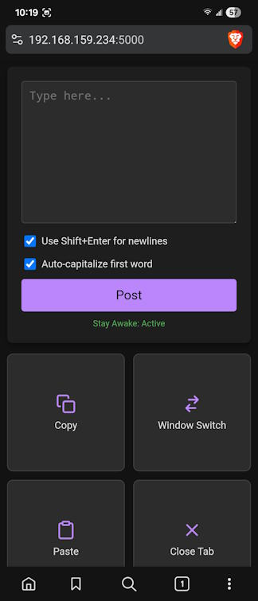

# Phone Keyboard

A simple Flask application to enable the user to type on a computer using their phone's touch and voice keyboard for improved accessibility. Mostly vibe coded using [Google Jules](https://jules.google.com/).

**Security Warning:** This application simulates physical keypresses on the host computer. While connections are strictly restricted to HTTPS and require a 5-digit authentication PIN printed to the server console, you should still avoid running it on untrusted public networks or port-forwarding it to the open internet.

## Installation and Usage
After cloning the repo install the package in editable mode:
```sh
pip install -e .
```

Run it via the console script:
```sh
phone-keyboard
```

Open your phone's browser at `https://<computer-ip>:5000/`, enter the PIN when prompted, and start typing.

### HTTPS & Certificate Setup
HTTPS is required both for server communication and to enable the Screen Wake Lock JS API on your phone.
1. The application will automatically generate `cert.pem` and `key.pem` the first time it runs, specific to your local IP address.
2. Transfer `cert.pem` to your device.
3. Install it:
    - **Android**: Go to `Settings > Security > More security settings > Encryption & credentials > Install a certificate > CA certificate` and select `cert.pem`.
    - **iOS**:
      - Open the file and follow the prompts to install the profile.
      - Go to `Settings > General > VPN & Device Management` and ensure the profile is installed.
      - Go to `Settings > General > About > Certificate Trust Settings` and enable "Full Trust" for the self-signed certificate.

## Screenshot

